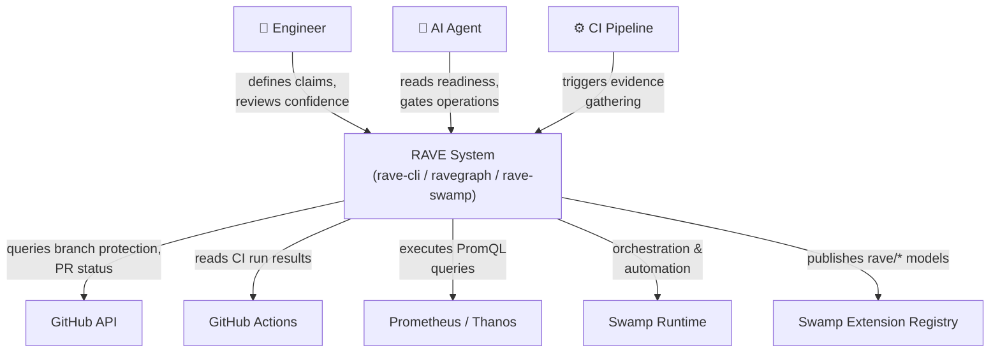

# L1 — System Context

## What RAVE Does

RAVE sits between reliability intent and operational reality. It makes reliability claims explicit, links them to evidence from real systems, and continuously validates them — surfacing decay before it becomes an incident.

## Users

| Actor | Role |
|---|---|
| **Engineer** | Defines claims, reviews confidence scores, responds to falsifier alerts |
| **AI agent** | Reads claim and readiness state to gate deployments and operations |
| **CI pipeline** | Triggers evidence gathering; provides CI run results as evidence |
| **Community** | Views source, raises issues, forks the pattern for their own systems |

## External Systems

| System | How RAVE Uses It |
|---|---|
| **GitHub API** | Branch protection status, PR merge enforcement, repo metadata |
| **GitHub Actions** | CI run results as evidence (pass/fail, duration, timestamp) |
| **Prometheus / Thanos / VictoriaMetrics** | PromQL query results as evidence (SLO signals, error rates) |
| **Swamp** | Automation runtime — runs evidence gathering, confidence decay, falsifier sweeps |
| **Swamp Extension Registry** | Publishes `rave/*` extension models for community reuse |

## System Context Diagram

