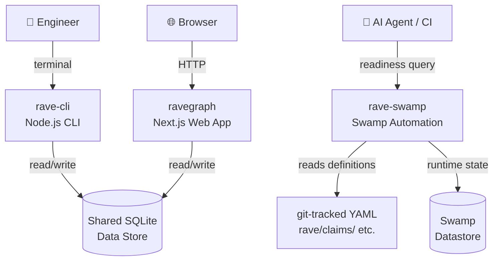

# L2 — Containers

## Deployable Units

### rave-spec
Static documentation. Published as Markdown + YAML to GitHub. No runtime.

### rave-cli
Node.js CLI. Reads and writes the shared SQLite data store. Distributed as an npm package.

- **Language:** TypeScript / Node.js 22+
- **Persistence:** Shared SQLite file (via Drizzle ORM)
- **Key commands:** `rave claim`, `rave evidence`, `rave scope`, `rave readiness`

### ravegraph
Next.js 15 web application (standalone output). Reads and writes the same shared SQLite file as `rave-cli`. Serves the claims scorecard UI.

- **Language:** TypeScript / React / Next.js 15
- **Persistence:** Shared SQLite file (via Drizzle ORM — same schema as rave-cli)
- **Deployment:** Standalone Node.js server

### Shared SQLite Data Store
The single source of runtime truth for `rave-cli` and `ravegraph`. Contains claims, evidence results, confidence scores, falsifier state, and scope definitions.

- One file, two interfaces
- Schema owned jointly by `rave-cli` and `ravegraph` (migration tracked in both; see [ADR-001](../adr/ADR-001-shared-sqlite-datastore.md))

### rave-swamp
Swamp-based automation layer. Reads git-tracked YAML (`rave/claims/`, `rave/evidence/`, etc.) as the source of truth for definitions; writes runtime state to Swamp's own datastore. Publishes `rave/*` extension models to the Swamp registry.

- **Language:** TypeScript / Deno (Swamp extensions)
- **Persistence:** Swamp datastore (separate from SQLite)
- **Automation:** Evidence gathering, confidence decay sweep, falsifier evaluation

## Container Diagram

## Open Question

`rave-cli` and `ravegraph` currently live in separate repos but share a data store and schema. If schema coordination becomes painful, merging them into a single monorepo is the natural next step. See [GitHub issue to be raised](https://github.com/mesgme/rave-cli/issues).
